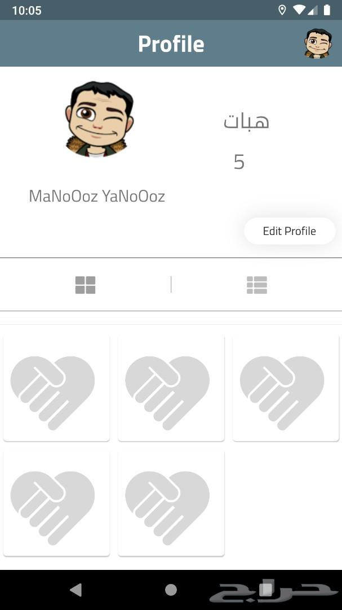
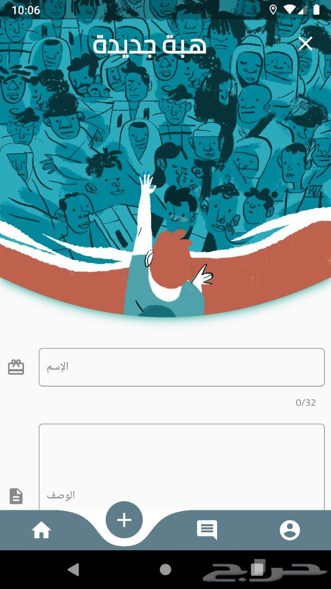
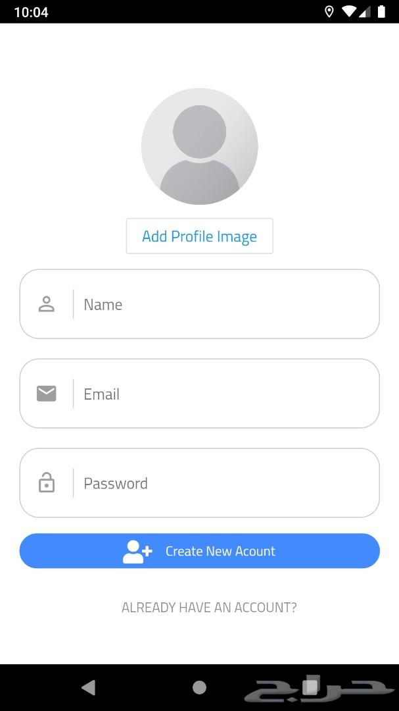
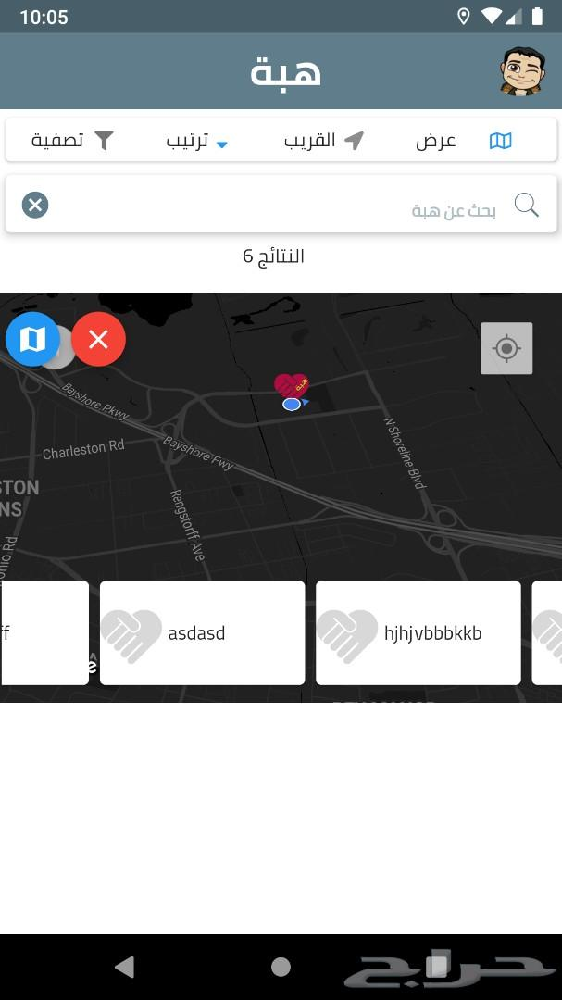

# heba_project
Project Discussions : Discord Channel https://discord.gg/DgkpnVM

# heba_project

Charity Project  .... if you are interested to Join me  fork the project and show me the magic 
Project Idea : Let Users To  give Items and  help to those in need ,, Depend On location 
FrontEnd: Flutter Framework (Flutter 1.12.13+hotfix.6 • channel beta)
BackEnd : Firebase

 المشروع في المراحل الأولي 

طريقة المشاركة : 
عمل fork للمشروع على git hub والتطوير عليه 
سيتم تقسيم العمل على مراحل وللمشاركين الرغبة في إختيار العمل المراد إنجازه 
 
طريقة عمل التطبيق : 
سيتم عمل uml لا حقا 
لكن مبدئيا المشروع حيكون كالتالي : 
يقوم المستخدم بالتسجيل بالتطبيق 
يقوم المستخدم الواهب بإضافة هبة معينة  مع صور وتظهر في الخريطة 
يتم عرض الهبات في قائمة 
يقوم المستخدم الموهوب بالتواصل مع الواهب من خلال التطبيق أو من خلال معلومات الإتصال 
يقوم المستخدم الواهب بحذف الهبة بعد إعطائها 

الأدوات المستخدمة : 
FrontEnd: Flutter Framework (Flutter 1.12.13+hotfix.6 • channel beta)
BackEnd : Firebase
Flutter 1.12.13+hotfix.6 • channel beta • https://github.com/flutter/flutter.git
Lang • Dart 2.7.0
relese key Info : 123123 All

